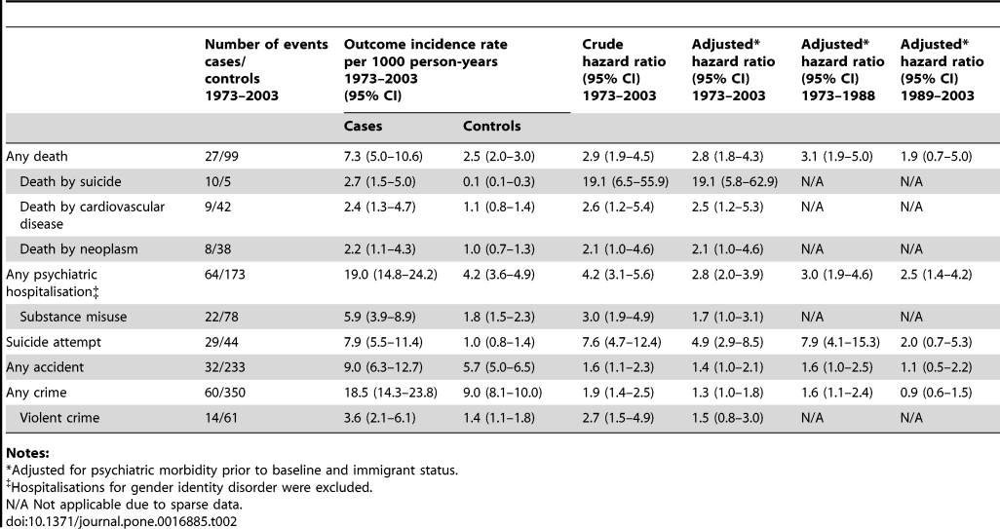

http://journals.plos.org/plosone/article?id=10.1371/journal.pone.0016885

**Long-Term Follow-Up of Transsexual Persons Undergoing Sex
Reassignment Surgery: Cohort Study in Sweden**

Cecilia Dhejne, Paul Lichtenstein, Marcus Boman, Anna L. V. Johansson,
Niklas Långström, Mikael Landén

PLOS

Published: February 22, 2011
http://dx.doi.org/10.1371/journal.pone.0016885

## Results

We identified 324 transsexual persons (exposed cohort) who underwent
sex reassignment surgery and were assigned a new legal sex between
1973 and 2003. These constituted the sex-reassigned (exposed)
group. Fifty-nine percent (N = 191) of sex-reassigned persons were
male-to-females and 41% (N = 133) female-to-males, yielding a sex
ratio of 1.4∶1 (Table 1).

...

### Crime rate

Transsexual individuals were at increased risk of being convicted for
any crime or violent crime after sex reassignment (Table 2); this was,
however, only significant in the group who underwent sex reassignment
before 1989.

#### Gender differences

Comparisons of female-to-males and male-to-females, although hampered
by low statistical power and associated wide confidence intervals,
suggested mostly similar risks for adverse outcomes (Tables S1 and
S2). However, violence against self (suicidal behaviour) and others
([violent] crime) constituted important exceptions. First, ... *(part
about suicide attempt rates)* ...

Second, regarding any crime, male-to-females had a significantly
increased risk for crime compared to female controls (aHR 6.6; 95% CI
4.1–10.8) but not compared to males (aHR 0.8; 95% CI 0.5–1.2). This
indicates that they retained a male pattern regarding criminality. The
same was true regarding violent crime. By contrast, female-to-males
had higher crime rates than female controls (aHR 4.1; 95% CI 2.5–6.9)
but did not differ from male controls. This indicates a shift to a
male pattern regarding criminality and that sex reassignment is
coupled to increased crime rate in female-to-males. The same was true
regarding violent crime.

